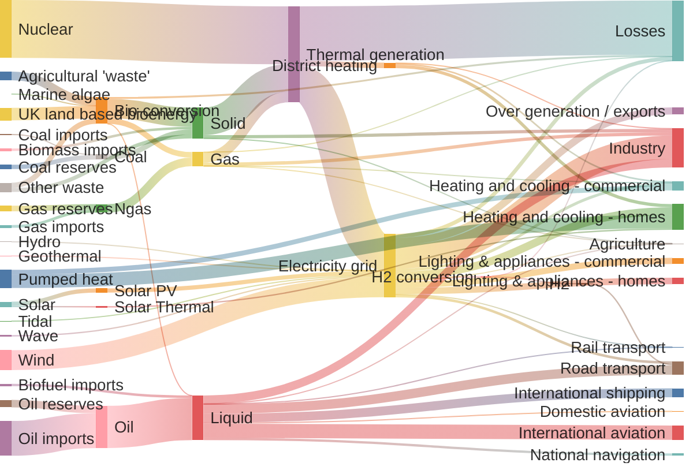

## Basic Syntax

Markdown is a lightweight and easy-to-use syntax for styling your writing.

### Headers

When the content of the article is extensive, you can use headers to segment:

```markdown
# Header 1

## Header 2

## Large Header

### Small Header
```

Header previews would disrupt the structure of the article, so they are not displayed here.

### Bold and Italics

```markdown
_Italic text_ and **Bold text**, together will be **_Bold Italic text_**
```

Preview:

_Italic text_ and **Bold text**, together will be **_Bold Italic text_**

### Links

```markdown
Text link [Link Name](http://link-url)
```

Preview:

Text link [Link Name](http://link-url)

### Inline Code

```markdown
This is an `inline code`
```

Preview:

This is an `inline code`

### Code Blocks

````markdown
```js
// calculate fibonacci
function fibonacci(n) {
  if (n <= 1) return 1
  const result = fibonacci(n - 1) + fibonacci(n - 2) // [\!code --]
  return fibonacci(n - 1) + fibonacci(n - 2) // [\!code ++]
}
```
````

Preview:

```js
// calculate fibonacci
function fibonacci(n) {
  if (n <= 1) return 1
  const result = fibonacci(n - 1) + fibonacci(n - 2) // [!code --]
  return fibonacci(n - 1) + fibonacci(n - 2) // [!code ++]
}
```

Currently using shiki as the code highlighting plugin. For supported languages, refer to [Shiki: Languages](https://shiki.matsu.io/languages.html).

### Inline Formula

```markdown
This is an inline formula $e^{i\pi} + 1 = 0$
```

Preview:

This is an inline formula $e^{i\pi} + 1 = 0$

### Formula Blocks

```markdown
$$
\hat{f}(\xi) = \int_{-\infty}^{\infty} f(x) e^{-2\pi i x \xi} \, dx
$$
```

Preview:

$$
\hat{f}(\xi) = \int_{-\infty}^{\infty} f(x) e^{-2\pi i x \xi} \, dx
$$

Currently using KaTeX as the math formula plugin. For supported syntax, refer to [KaTeX Supported Functions](https://katex.org/docs/supported.html).

#### Images

```markdown

```

Preview:


#### Strikethrough

```markdown
~~Strikethrough~~
```

Preview:

~~Strikethrough~~

### Lists

Regular unordered list

```markdown
- 1
- 2
- 3
```

Preview:

- 1
- 2
- 3

Regular ordered list

```markdown
1. GPT-4
2. Claude Opus
3. LLaMa
```

Preview:

1. GPT-4
2. Claude Opus
3. LLaMa

You can continue to nest syntax within lists.

### Blockquotes

```markdown
> Gunshot, thunder, sword rise. A scene of flowers and blood.
```

Preview:

> Gunshot, thunder, sword rise. A scene of flowers and blood.

You can continue to nest syntax within blockquotes.

### Line Breaks

Markdown needs a blank line to separate paragraphs.

```markdown
If you don't leave a blank line
it will be in one paragraph

First paragraph

Second paragraph
```

Preview:

If you don't leave a blank line
it will be in one paragraph

First paragraph

Second paragraph

### Separators

If you have the habit of writing separators, you can start a new line and enter three dashes `---` or asterisks `***`. Leave a blank line before and after when there are paragraphs:

```markdown
---
```

Preview:

---

## Advanced Techniques

### Inline HTML Elements

Currently, only some inline HTML elements are supported, including `<kdb> <b> <i> <em> <sup> <sub> <br>`, such as

#### Key Display

```markdown
Use <kbd>Ctrl</kbd> + <kbd>Alt</kbd> + <kbd>Del</kbd> to reboot the computer
```

Preview:

Use <kbd>Ctrl</kbd> + <kbd>Alt</kbd> + <kbd>Del</kbd> to reboot the computer

#### Bold Italics

```markdown
<b> Markdown also applies here, such as _bold_ </b>
```

Preview:

<b> Markdown also applies here, such as _bold_ </b>

### Other HTML Writing

#### Foldable Blocks超长的标题中文Foldable Blocks超长的标题中文

```markdown
<details><summary>Click to expand</summary>It is hidden</details>
```

Preview:

<details><summary>Click to expand</summary>It is hidden</details>

### Tables

```markdown
| Header1  | Header2  |
| -------- | -------- |
| Content1 | Content2 |
```

Preview:

| Header1  | Header2  |
| -------- | -------- |
| Content1 | Content2 |

### Footnotes

```markdown
Use [^footnote] to add a footnote at the point of reference.

Then, at the end of the document, add the content of the footnote (it will be rendered at the end of the article by default).

[^footnote]: Here is the content of the footnote
```

Preview:

Use [^footnote] to add a footnote at the point of reference.

Then, at the end of the document, add the content of the footnote (it will be rendered at the end of the article by default).

[^footnote]: Here is the content of the footnote

### To-Do Lists

```markdown
- [ ] Incomplete task
- [x] Completed task
```

Preview:

- [ ] Incomplete task
- [x] Completed task

### Symbol Escaping

If you need to use markdown symbols like \_ # \* in your description but don't want them to be escaped, you can add a backslash before these symbols, such as `\_` `\#` `\*` to avoid it.

```markdown
\_Don't want the text here to be italic\_

\*\*Don't want the text here to be bold\*\*
```

Preview:

\_Don't want the text here to be italic\_

\*\*Don't want the text here to be bold\*\*

---

## Embedding Astro Components

See [User Components](/docs/integrations/components) and [Advanced Components](/docs/integrations/advanced) for details.


