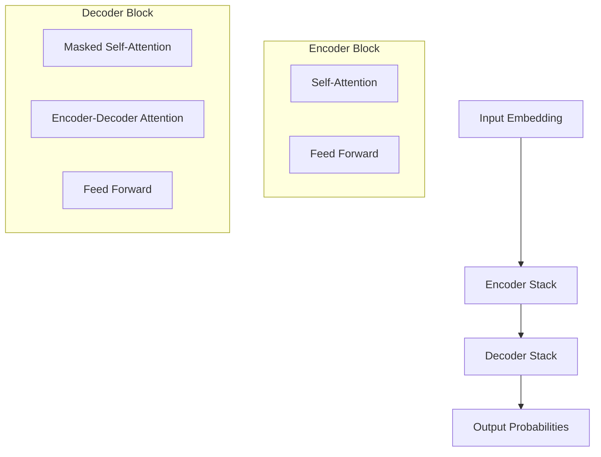

import Paper from '@/custom/components/pages/Paper.astro'

<Paper paper={{
  id: 'attention-is-all-you-need',
  data: {
    title: 'Attention Is All You Need Attention  You NeedAttention Is ',
    subTitle: 'xxxxxxx',
    publishDate: '2017-12-06',
    journal: 'NeurIPS 2017',
    doi: '10.1080/10286632.2013.832233',
    isbn: '123-4123-1525-5123',
    citations: 123456,
    paperUrl: "https://example.com/paper",
    star: 6,
    tags: ['Transformer', 'Attention Mechanism', 'Neural Networks Neural Networks Neural Networks Neural Networks Neural Networks',]
  },
  index: 99
}} />

> [!note] Change $\alpha_k$ adaptively
> One way to increase the performance of our model is to let the optimizer change $\alpha_k$ adaptively.

<Paper paper={{
  id: 'attention-is-all-you-need',
  data: {
    title: 'Attention Is All You Need',
    subTitle: 'Introducing the Transformer architecture',
    publishDate: '2017-12-06',
    citations: 123456,
    tags: ['Transformer', 'Attention Mechanism', 'Neural Networks']
  },
  index: 1
}} />

<Paper paper={{
  id: 'attention-is-all-you-need',
  data: {
    title: 'Attention Is All You Need Attention  You NeedAttention Is ',
    publishDate: '2017-12-06',
    journal: 'NeurIPS 2017',
    star: 6,
    publisher: 'arxiv',
    tags: ['Transformer', 'Attention Mechanism', 'Neural Networks Neural Networks Neural Networks Neural Networks Neural Networks',]
  },
  index: 1002
}} />

> [!note] ##### The *Euler* formula: $e^{i \pi} + 1 = 0$
> As we know, the Euler formula is ...

## 核心创新点

1. **纯注意力机制**
   - 完全抛弃了循环和卷积结构
   - 通过自注意力机制实现并行计算
   - 显著提高了训练效率

2. **多头注意力**
   - 允许模型关注不同的表示子空间
   - 增强了模型的表达能力
   - 提供了更丰富的特征提取能力

## 关键架构设计

### Encoder-Decoder 结构

### 位置编码

位置编码使用正弦和余弦函数：

$$
PE_{(pos,2i)} = sin(pos/10000^{2i/d_{model}})
$$

$$
PE_{(pos,2i+1)} = cos(pos/10000^{2i/d_{model}})
$$

## 实验结果

> [!note] 关键发现
> Transformer 在多个翻译任务上都取得了当时最好的效果，同时训练时间显著减少。

| 模型 | BLEU 分数 | 训练时间 |
|-----|-----------|---------|
| Transformer (base) | 27.3 | 12 小时 |
| Transformer (big) | 28.4 | 3.5 天 |
| ConvS2S | 26.4 | N/A |
| GNMT + RL | 26.3 | N/A |

## 个人思考

1. Transformer 架构的优势：
   - 并行计算能力强
   - 可以捕获长距离依赖
   - 模型可解释性较好

2. 潜在局限：
   - 计算复杂度随序列长度呈平方增长
   - 位置编码方案可能不够优雅
   - 在某些特定任务上可能不如专门设计的模型

## 影响与启发

这篇论文开创了 NLP 领域的新范式，影响深远：

- GPT 系列模型都基于 Transformer 架构
- BERT 等双向编码模型的基础
- 启发了 ViT 等计算机视觉模型

> [!tip] 推荐阅读
> 如果你对 Transformer 感兴趣，强烈推荐阅读 "The Annotated Transformer" 这篇博客，它提供了详细的代码实现讲解。

## 参考资源

1. [论文原文](https://arxiv.org/abs/1706.03762)
2. [The Annotated Transformer](http://nlp.seas.harvard.edu/2018/04/03/attention.html)
3. [Transformer 可视化](https://jalammar.github.io/illustrated-transformer/)

[^1]: 本文所有图表均来自原论文或基于原论文重新绘制。
