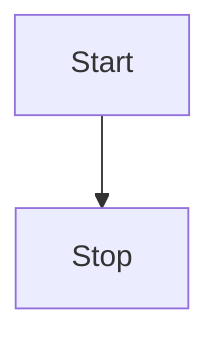
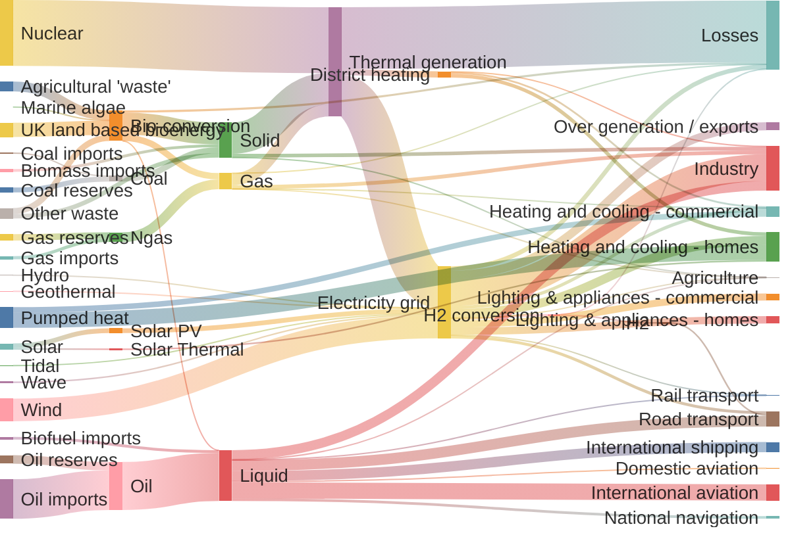

1
2
3

正常段落的内容换行是什么样的呢，有什么需要调整的吗 1 正常段落的内容换行是什么样的呢，有什么需要调整的吗 2
正常段落的内容换行是什么样的呢，有什么需要调整的吗 3yingwenduiqi 的怎么样
正常段落的内容换行是什么样的呢，有什么需要调整的吗 4

````markmap
---
id: markmap-example
style: |
  #${id} {
    height: 300px;
    width: 100%;
  }
  @media (min-width: 1280px) {
    #${id} {
      height: 600px;
    }
  }
options:
  colorFreezeLevel: 2
---

## Links

- [Website](https://markmap.js.org/)
- [GitHub](https://github.com/gera2ld/markmap)

## Related Projects

- [coc-markmap](https://github.com/gera2ld/coc-markmap) for Neovim
- [markmap-vscode](https://marketplace.visualstudio.com/items?itemName=gera2ld.markmap-vscode) for VSCode
- [eaf-markmap](https://github.com/emacs-eaf/eaf-markmap) for Emacs

## Features

Note that if blocks and lists appear at the same level, the lists will be ignored.

### Lists

- **strong** ~~del~~ *italic* ==highlight==
- `inline code`
- [x] checkbox
- Katex: $x = {-b \pm \sqrt{b^2-4ac} \over 2a}$ <!-- markmap: fold -->
  - [More Katex Examples](#?d=gist:af76a4c245b302206b16aec503dbe07b:katex.md)
- Now we can wrap very very very very long text based on `maxWidth` option
- Ordered list
  1. item 1
  2. item 2

### Blocks

```js
console.log('hello, JavaScript')
```

| Products | Price |
|-|-|
| Apple | 4 |
| Banana | 2 |


### test
```java
String a = '1'
```

>[!note] 11
> 123
>>[!note] 22 
>> 1
>
> > 2

````


[[blog/a|123]]

```java
String a = '1'
```
4


