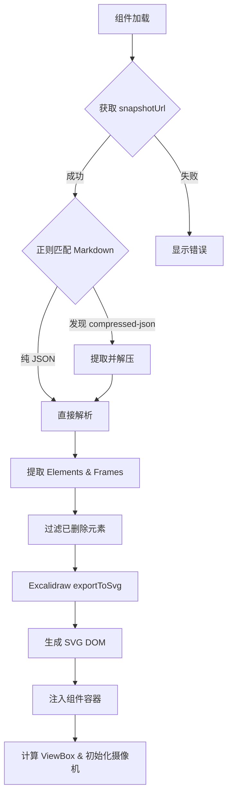

import { Excalidraw } from '@/components/mdx/Excalidraw'
import IconLink from '@/components/IconLink.astro'

本文介绍了如何在博客中集成自定义的 `Excalidraw` 组件，实现在 MDX 文档中直接渲染交互式的白板绘图。该组件不仅支持标准的 Excalidraw 文件，还完美兼容 Obsidian 插件导出的格式。

## 简介

`Excalidraw` 组件是一个基于 React 的轻量级渲染器，专为在 MDX 环境中展示白板绘图而设计。为了获得最佳的编辑体验和资源占用，本组件**专注于支持 Obsidian Excalidraw 插件生成的 Markdown (.md) 文件**。通过直接解析压缩的 JSON 场景数据，实现在现代 web 环境中的完美渲染。

## 处理流程

下图展示了组件加载和渲染核心流程：



## 核心功能

*   **Obsidian 原生支持**: 完美解析 Obsidian Excalidraw 插件生成的 `.md` 文件，无需导出。
*   **幻灯片展示 (Frames)**: 自动识别绘图中的 "画框" (Frame)，并按标题或位置排序，支持平滑的演示导航。
*   **Magic Animations (魔法动画)**: 通过特定的“颜色+线型”组合触发持续动画：
    *   **蓝色 (#0000ff) + 虚线**: 自动触发“线条流动”效果（如模拟电流/水流）。
    *   **红色 (#ff0000) + 虚线**: 自动触发“呼吸灯”效果（用于关键警告）。
*   **极致性能**: 直接操作 SVG 的 `viewBox` 进行缩放 (Zoom) 与平移 (Pan)，避免 Canvas 重绘。
*   **无感知集成**: 组件在客户端实时导出 SVG，完美融入站点背景与样式，文字可搜索。
*   **告别 .excalidraw**: 废弃体积庞大且不便协作的原始 JSON 格式，全面转向 Markdown 工作流。

## 示例演示

### 1. 多画框演示 (Obsidian .md)

这是最推荐的使用方式：在 Obsidian 中通过 Frame 组织内容，组件会自动生成导航控件。

<Excalidraw 
    snapshotUrl="/excalidraw/test-2.md" 
    client:only="react" 
>
  <div slot="exc-title" class="flex items-center gap-2">
    <IconLink href="#" class="text-sm font-semibold text-gray-700">
      多画框演示 (test-2.md)
    </IconLink>
    <span class="text-xs text-green-500 font-bold">New</span>
  </div>
</Excalidraw>

```tsx
<Excalidraw 
    snapshotUrl="/excalidraw/test-2.md" 
    client:only="react" 
/>
```

### 2. 基础方案图示例

<Excalidraw 
    snapshotUrl="/excalidraw/ob-e-m.md" 
    client:only="react" 
>
  <span slot="exc-title">系统架构草稿 (.md)</span>
</Excalidraw>

```tsx
<Excalidraw 
    snapshotUrl="/excalidraw/ob-e-m.md" 
    client:only="react" 
/>
```

## 组件参数 (Props)

| 属性名 | 类型 | 默认值 | 说明 |
| :--- | :--- | :--- | :--- |
| `snapshotUrl` | `string` | **必填** | `.md` 文件或 JSON 数据路径 (放至 public 目录) |
| `height` | `number \| string` | `500` | 容器高度 |
| `exc-title` | `ReactNode` | `undefined` | 标题栏内容 (推荐使用 `slot="exc-title"`) |
| `fontFamily` | `string` | `system-ui...` | 文本渲染优先使用的字体栈 |

## 技术实现原理

1.  **数据流**: 组件通过异步 `fetch` 获取文本，利用正则高效提取 `compressed-json` 代码块。
2.  **透明渲染**: 利用官方 `@excalidraw/excalidraw` 库的导出接口，在浏览器端生成精准的 SVG DOM。
3.  **坐标对齐**: 自动计算所有可见元素的边界框（Bounding Box），并应用偏移修正，确保 SVG `viewBox` 与实际绘图坐标系完美对齐。
4.  **运镜系统**: 采用摄像机插值算法，在切换 Frame 时通过 `requestAnimationFrame` 实现平滑的缩放和位移。