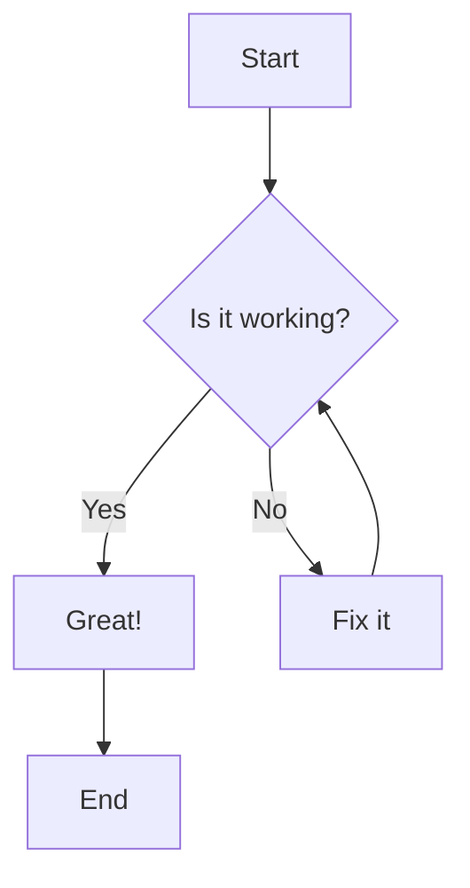

**我 bqweq**

== b 高 ==

[bddsfdsfsddffds](http://bilibili.com)
[g](http://github.com)
[x](http://x.com)
[y](http://youtube.com)
[a](http://acm.com)
[d](http://localhost:4321)

## wikilink
- 内部链接：[[blog/test_inner|测试用的内部链接_可以自定义显示文本]]
- 内部链接：[[blog/test/x|not found]]
- blog 下不同子文件夹同名： [[blog/m2|en md]]

## mermaid
