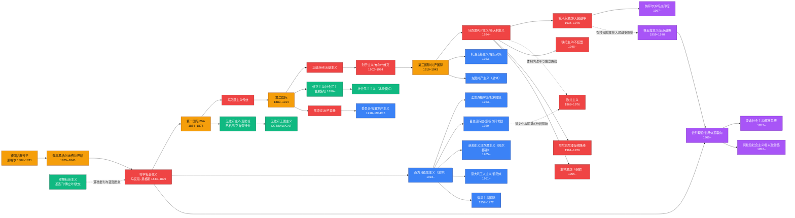

## 国际共运史

```mermaid
flowchart LR
    %% 基础
    A[德国古典哲学<br/>黑格尔 1807–1831]:::org
    B[青年黑格尔派/费尔巴哈<br/>1835–1845]:::org
    C[空想社会主义<br/>圣西门/傅立叶/欧文]:::parallel

    A --> B
    B --> D[科学社会主义<br/>马克思–恩格斯 1844–1895]:::marx
    C -.道德批判与蓝图启发.-> D

    %% 国际组织与第一次大分化
    D --> I1[第一国际 IWA<br/>1864–1876]:::org
    I1 --> E[马克思主义传统]:::marx
    I1 --> F[无政府主义/互助论<br/>巴枯宁/克鲁泡特金]:::parallel
    F --> F1[无政府工团主义<br/>CGT/IWW/CNT]:::parallel

    %% 第二国际与三条路
    E --> I2[第二国际<br/>1889–1914]:::org
    I2 --> K1[正统派/考茨基主义]:::marx
    I2 --> K2[修正主义/社会民主<br/>伯恩施坦 1896–]:::parallel
    I2 --> K3[革命左派/卢森堡]:::marx

    K2 --> SD[社会民主主义（北欧模式）]:::parallel
    K3 --> CC[委员会/左翼共产主义<br/>1918–1934/35]:::hetero

    %% 俄国道路与第三国际
    K1 --> L[列宁主义/布尔什维克<br/>1902–1924]:::marx
    L --> I3[第三国际/共产国际<br/>1919–1943]:::org

    I3 --> S[马克思列宁主义/斯大林主义<br/>1924–]:::marx
    I3 --> T[托洛茨基主义/左反对派<br/>1923–]:::hetero
    I3 --> LC[左翼共产主义（总体）]:::hetero

    S --> M[毛泽东思想/人民战争<br/>1935–1976]:::marx
    S -.体制内改革与独立路线.-> EC[欧共主义<br/>1968–1976]:::marx
    S --> TI[铁托主义/不结盟<br/>1948–]:::marx
    S --> ALB[阿尔巴尼亚反修路线<br/>1961–1976]:::marx

    M --> NX[纳萨尔派/毛派印度<br/>1967–]:::third
    M -.农村包围城市/人民战争影响.-> FO[格瓦拉主义/焦点战略<br/>1959–1970]:::third

    %% 西方马克思主义支脉
    D --> WM[西方马克思主义（总体）<br/>1923–]:::hetero
    WM --> FRK[法兰克福学派/批判理论<br/>1923–]:::hetero
    WM --> GRA[葛兰西传统/霸权与阵地战<br/>1929–]:::hetero
    WM --> ALT[结构主义马克思主义（阿尔都塞）<br/>1965–]:::hetero
    WM --> AUT[意大利工人主义/自治派<br/>1961–]:::hetero
    WM --> SIT[情境主义国际<br/>1957–1972]:::hetero

    %% 去殖民与区域化
    D --> DEP[依附理论/世界体系取向<br/>1966–]:::third
    FO --> DEP
    GRA -.对文化与同意的分析影响.-> EC
    DEP --> PAF[泛非社会主义/解放思想<br/>1957–]:::third
    DEP --> BA[阿拉伯社会主义/复兴党脉络<br/>1952–]:::third
    S --> JC[主体思想（朝鲜）<br/>1955–]:::marx

    %% 样式
    classDef marx fill:#ef4444,stroke:#7f1d1d,color:#fff;
    classDef hetero fill:#3b82f6,stroke:#1e3a8a,color:#fff;
    classDef parallel fill:#10b981,stroke:#065f46,color:#fff;
    classDef org fill:#f59e0b,stroke:#92400e,color:#111;
    classDef third fill:#a855f7,stroke:#6b21a8,color:#fff;
```